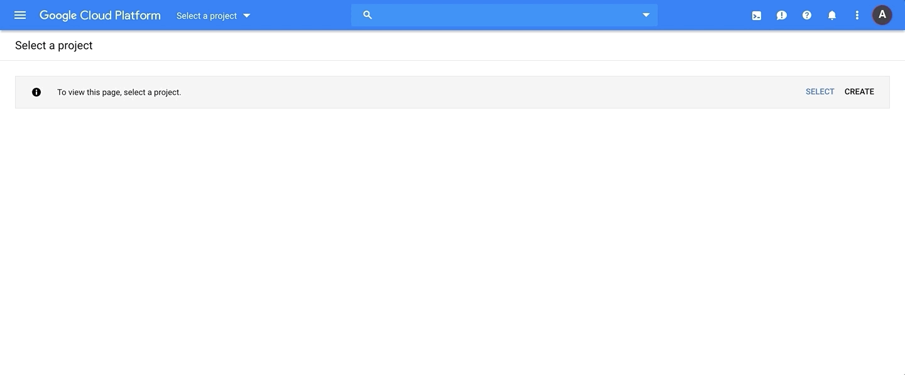
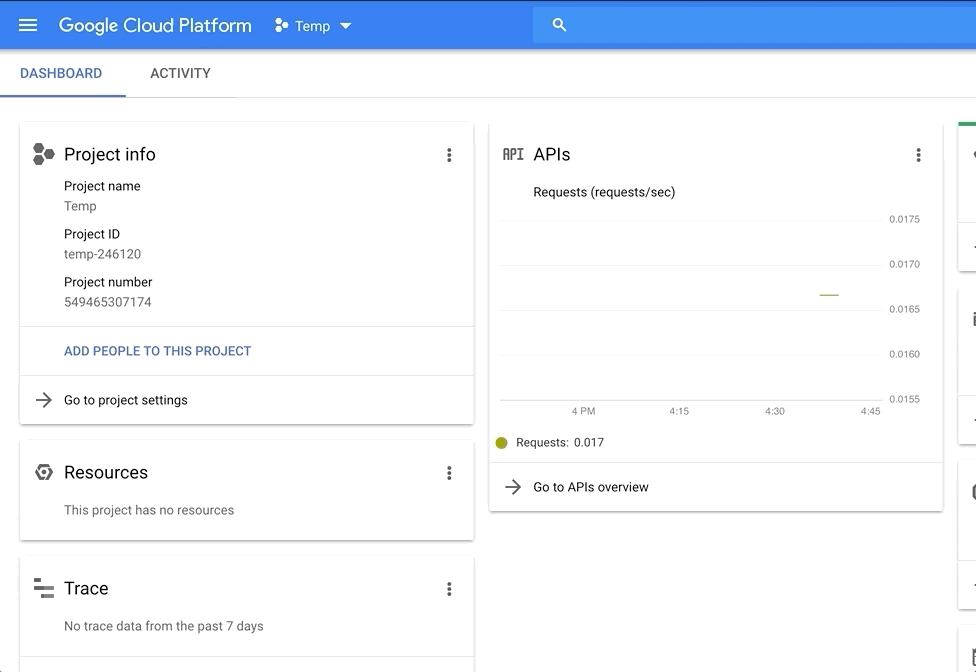
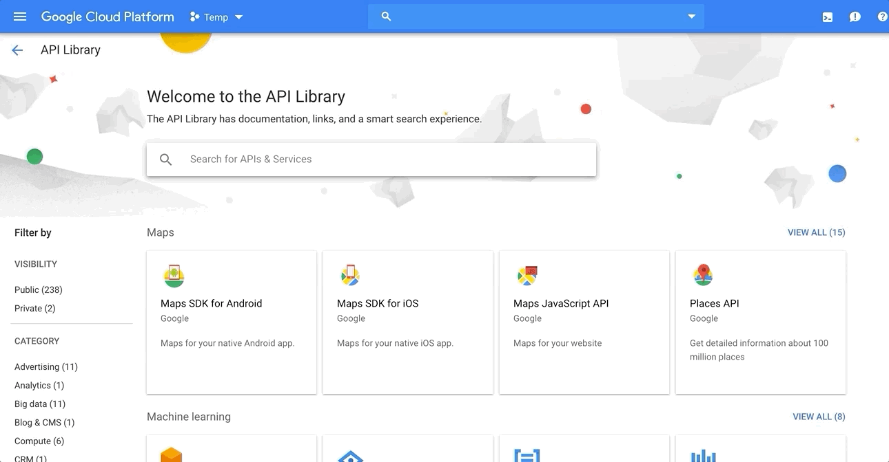
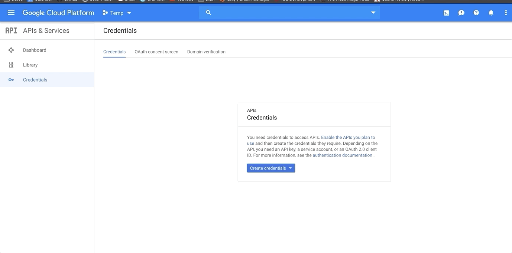

# GmailScanner

The project uses the [Google GMail API](https://developers.google.com/gmail/api/)
to parse and aggregate an authenticated user inbox information. 

The goal is to scan all emails under a certain email Label, collect the senders email and
feed the information to a Google Sheet.

# Project Setup
  - [Setup Google API Services](#Setup-Google-API-Services)

## Setup Google API Services
You'll need to create a Google Cloud Project and enable the Gmail API.

1. Visit the [Google Cloud Console](https://console.cloud.google.com/) Dashboard.
2. Create the new Project (name whatever) that'll be granted access to your email account.
   
3. Navigate to the API & Services>Library.
    
4. Enable Gmail API for the project
   
5. For authentication, we'll be using Oauth to access Google API services. From the Credentials window navigate to the **OAuth consent screen** tab and create the OAuth consent by adding your **Application name** and clicking save. 
6. Next, you'll create the Oauth client credentials, feel free to name the client whatever. 
   
7. After a successful credential creation, a popup will appear with your ClientID & Client Secret. **Save both of them  we'll need them later!!**

  
   